This cluster proposes the synthesis of ML and Generative Architectural Design.

We situate this work in terms of the data bais problem in machine learning. This cluster recognizes that this bias exists, and seeks to leverage it as ***a locus of a new form of subjectivity*** in design.

[[section]]

It may come as no surprise that machine learning has made rapid gains in recent years. 

. From left to right: Goodfellow et al (2014), Radford et al (2015), Liu and Tuzel (2016), Karras et al (2017). From General Framework for AI and Security Threats https://maliciousaireport.com/")

The sequence shown above clearly demonstrates this. Each of these images was generated by a computer, not as the manipulation of an existing photo, but rather as an entirely new form that matches an existing pattern of known forms drawn from experience.

***These are images that the computer has "drawn", on its own.***

Before discussing the position of the cluster, we take a moment to reflect on  the ramifications of a computer  that is capable of synthesizing images, of "drawing" pictures with such fidelity.

[[section]]

The thought of a computer drawing with the fidelity on display above is a little jarring. At least it is to me. I first studied architecture in the 1990s, when drawing as an activity was in transition from things like pencil and vellum and ink and mylar, to something very different. 

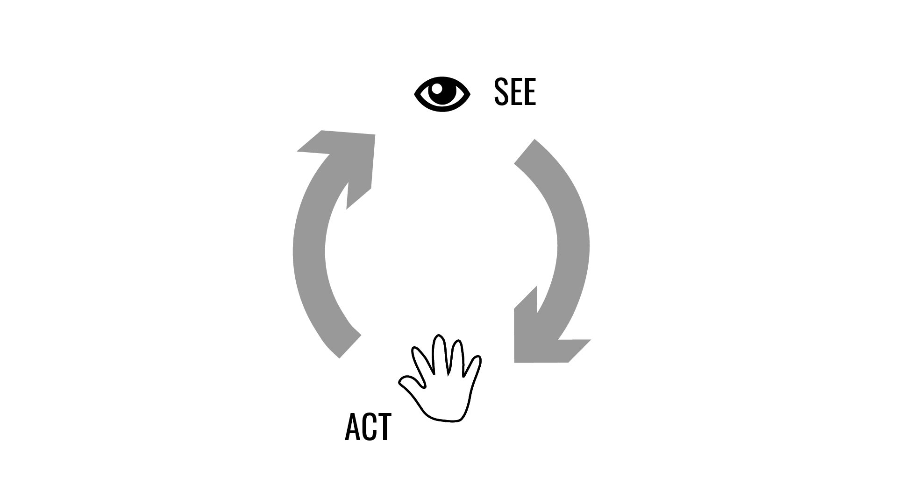

The mode of authorship enabled by traditional drawing tools seemed at the time to be a straightforward affair - a mode that remains very well described by what I now understand as the 'reflective loop' of design activity.

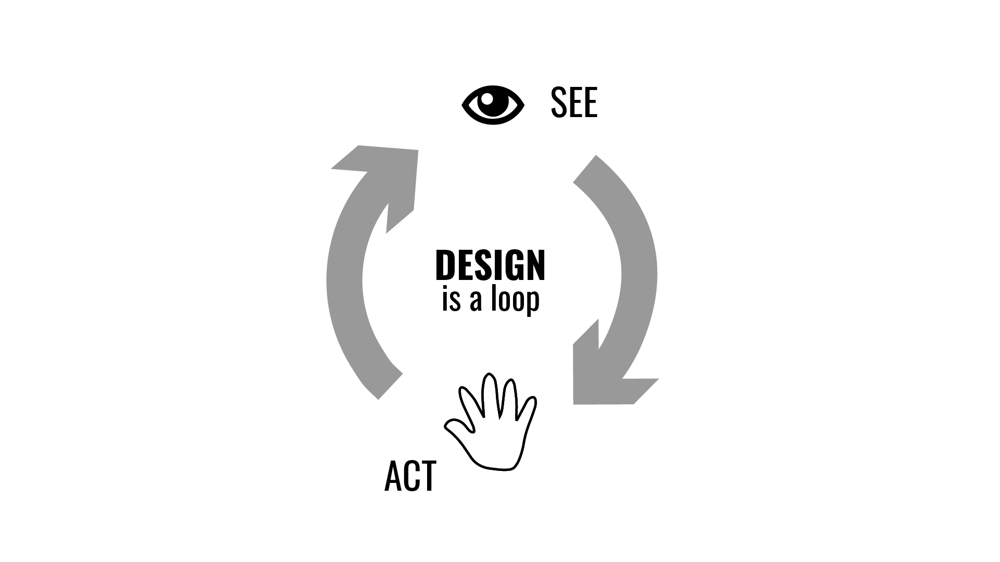

Despite all the changes brought about by the digital transformation of the early 2000's, this understanding of design activity as an iterative cycle of making and seeing basically held true.

Even as computers offered ***new forms of acting*** - from working indirectly on the shape of curves via control points, to assembling ornate chains of logic via scripting - these ***left the seeing to us humans***.

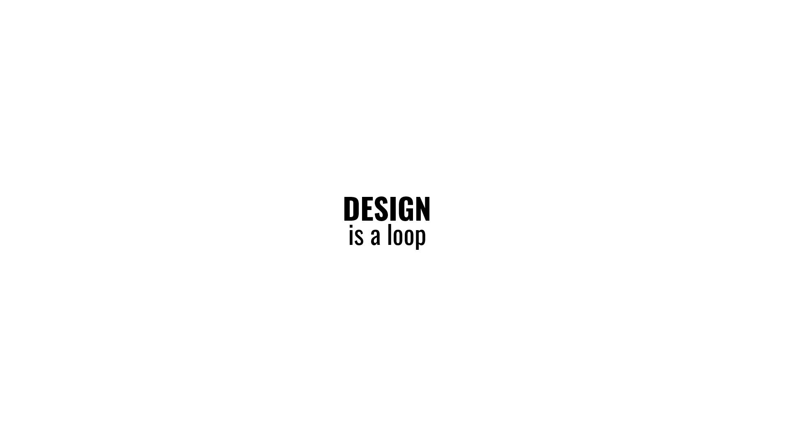

In the late 2000s, the advent of parametric modelling changed things slightly.

At this time, a new mode of design action found its way into practical application. It was a mode that formalized not only computational modes of acting, but also formalized modes of "seeing" (in a sense), and also structured the mechanisms of iteration.

This design method, novel in the early 2000s, has come to be known as ***generative design***.

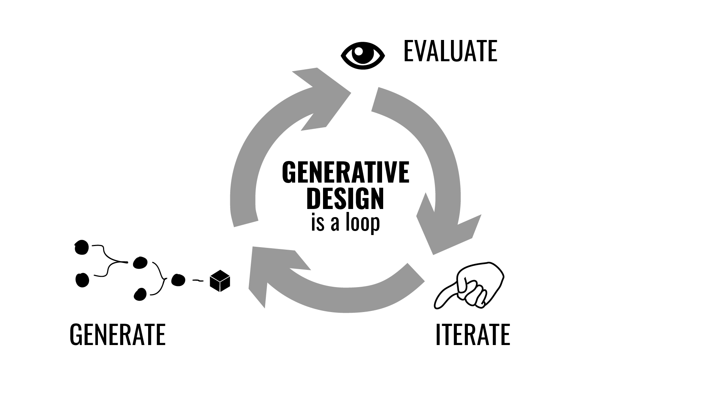

Generative Design in architecture is widely understood as a three-stage cycle:

In the generation step, new potential forms are proposed using a computational process.

In the evaluation step, the performance of these forms are quantified, again relying on computational analysis rather than the subjective eye of the designer

Finally, in the iteration step, the parameters of design generation are manipulated to find better results.

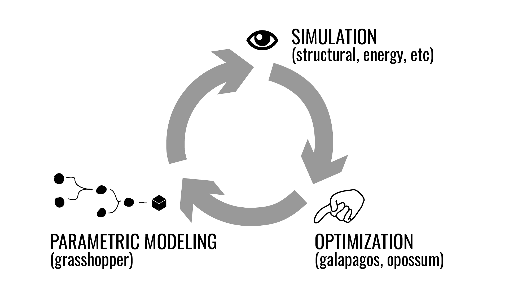

This approach typically employs a combination of parametric, simulation, and optimization tools.

Here is where the contribution of the cluster, in ***synthesizing ML and Generative Design***, comes into play.

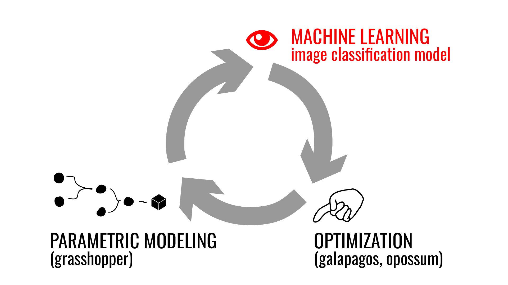

This cluster proposes ***a modest modification of the generative design process***.

We swap out the evaluation step of the cycle, which is typically the domain of architectural simulation, for a machine learning process: specifically a neural net trained on image classification of one form or another.

So, what is ML, and how can it fit into this process?

[[section|slide]]

***Machine Learning is learning through observation, in which patterns are mapped onto other patterns without any intervening representations.***

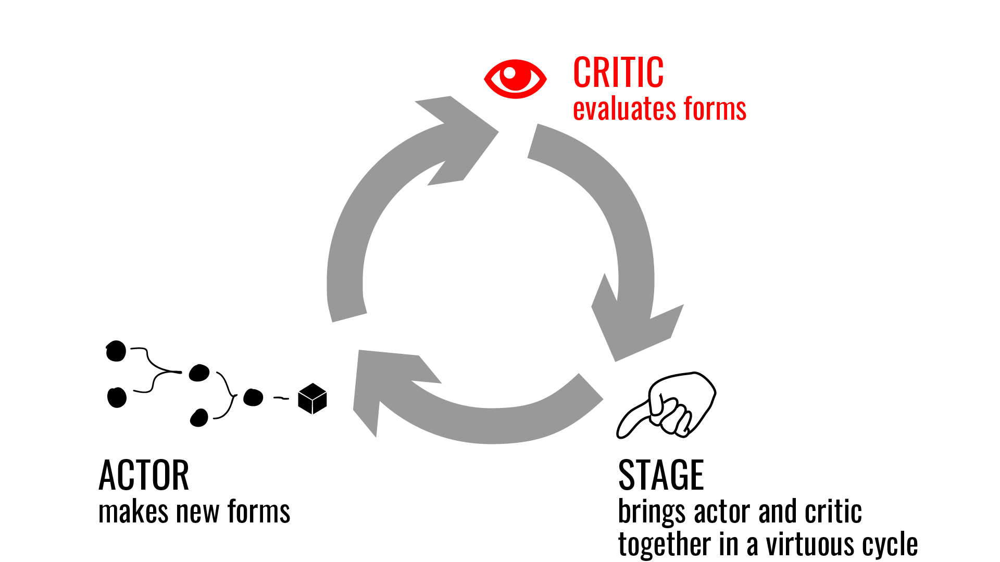

This process is different enough from traditional methods for evaluation, as to warrant an adjustment of the terms of generative design.

And so we re-define the generative design cycle as: actor, critic, stage.

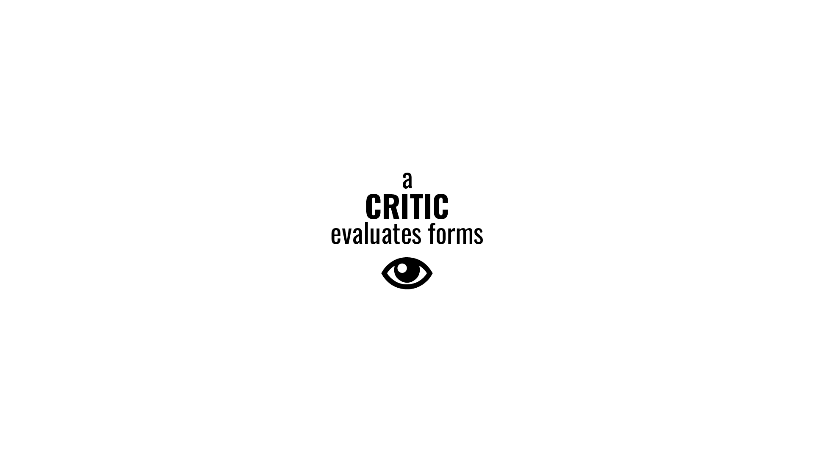

As before, an actor generates new forms, and describes them in a format preferred by ML.

The issue of format is a crucial one. For a variety of reasons, the most developed ML models relevant to architectural design operate on images. For this reason, we are content for now to insist that our actor re-present architectural form as image.

And so, one important contribution of the cluster involves the developing and testing of methods for describing architectural forms and spaces as images.

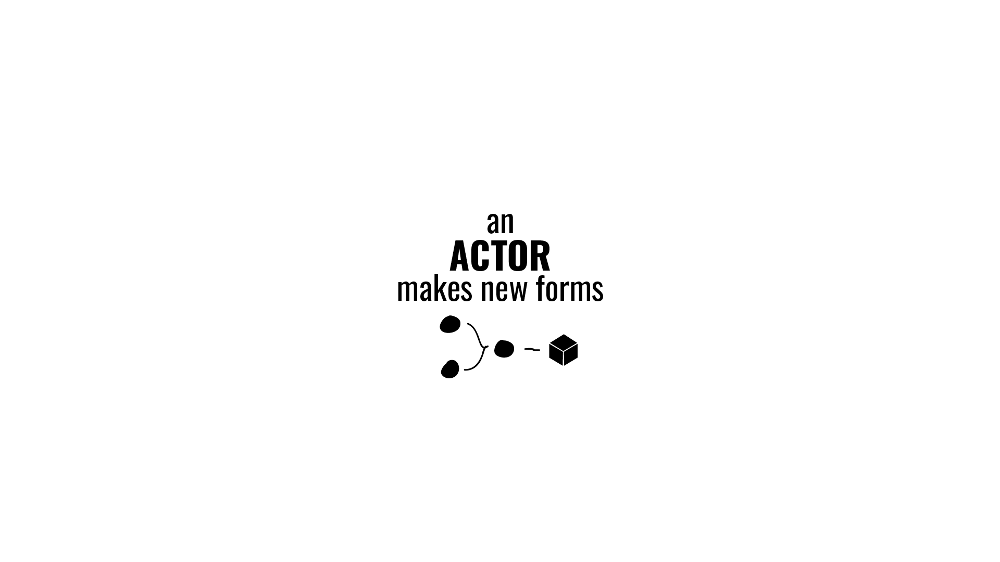

Moving on the evaluation step, we define a critic as a process that evaluates forms based on patterns and types learned from experience.

I should emphasize that the importance of training a critic should not be underestimated. This is ***an important new locus of creative action in design, an important new form of subjectivity*** and to cede this space to existing processes and models would be a huge loss for architectural design.

If architects are to remain relevant in the age of ML, ***designers must take ownership of the training of critics***.

To ensure that the participants in this workshop are not disenfranchised by an inability to train models relevant to them, we partnered with a company called [Lobe](www.lobe.ai), which sponsored our cluster.

Lobe provided an essential platform for training ML models relevant to architectural evaluation. As we see in the animation above, Lobe is a web-based visual tool for constructing models, training them, and allowing them to serve up predictions via API calls.

We might describe it with the analogy: as Grasshopper is to Rhino, so Lobe is to Tensorflow.

More valuable than this software, the most important contribution that Lobe made to the cluster was loaning us its CEO, Adam Menges, who served as one of the cluster champions and a core member of our group from the beginning.

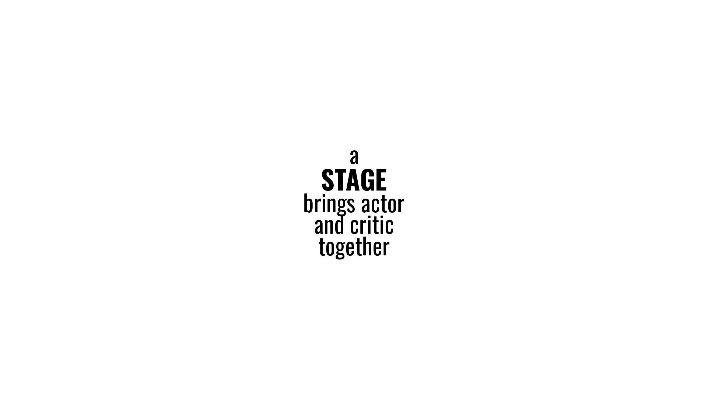

Finally, we define a stage as the system which brings together actor and critic, allowing an actor to progressively improve his performance. Here, traditional optimization techniques are employed.

To illustrate how all these pieces go together, we see in this animation an actor and critic coming together on a stage.

Here, a critic was trained on 3d models, such as the ones seen in the animation above, that describe typologies of detached single-family homes. These include Cape Cod, Shotgun, Dogtrot, and in homage to Toronto, the Bay and Gable.

The job of the critic is to evaluate the performance of an actor, which, in this case, is capable of generating a range of house-like forms, such as the ones we see flashing by on the left of the above animation.

These two intelligences are brought together in an optimization, wherein the actor generates new potential house forms, these forms are scored by the critic in terms of how much they resemble a known type of house (such as the California Eichler style shown here), and then the process iterates in a classic optimization.

As we can see, by modestly adjusting the nature of the evaluation step of the generative design process, we find a potential way forward from optimization for quantifiable objectives, as is typical in generative design, to more qualitative ones, such as architectural typology or spatial experience.

This is the framework that was introduced to cluster participants. These participants, over the course of the four-day workshop, probed, extended, exploded, and re-assembled this framework toward a variety of individual ends.

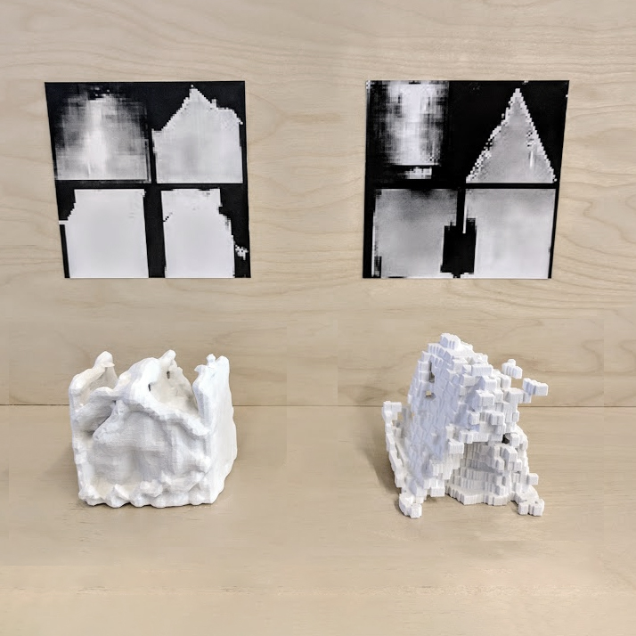
