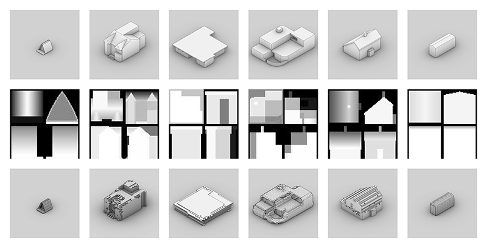
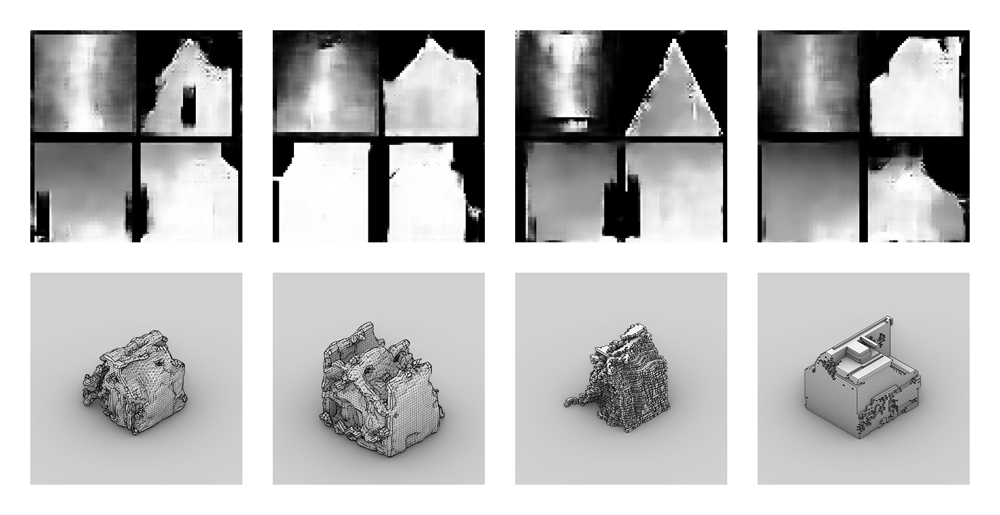
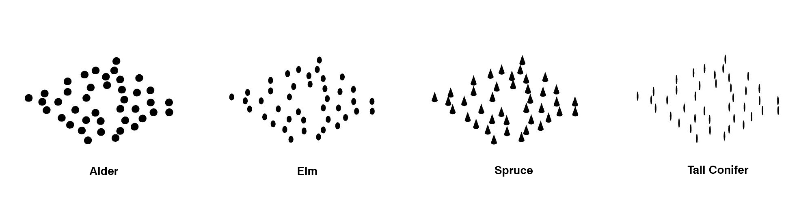
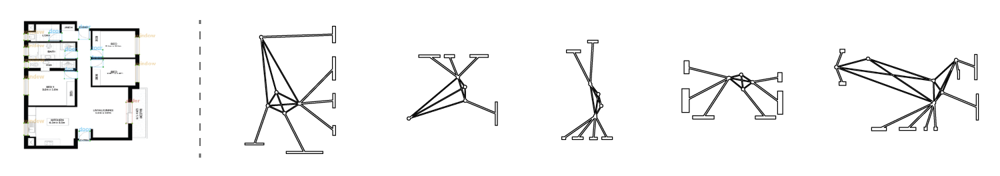
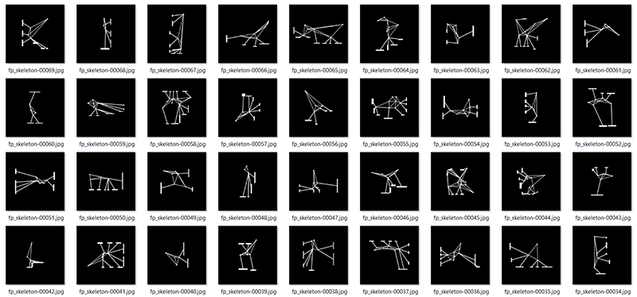
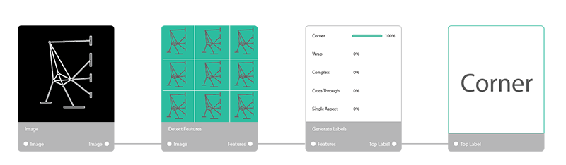
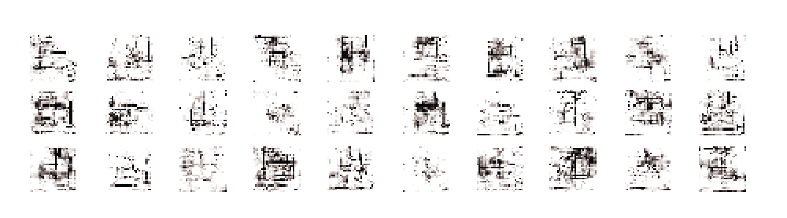
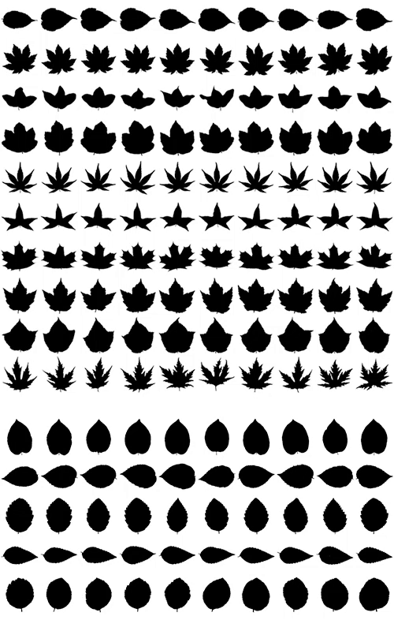

Over the course of this workshop, participants train purpose-built image-based ML models to evaluate candidate design solutions based on a variety of tacit and heretofore un-encapsulatable design criteria, such as architectural style, spatial experience, or typological features. Participants then deploy these models to the cloud, and integrate them into functional generative design systems via API calls.

[[section]]

Using the house training set, we tried running GAN (Generative Adversarial Networks) to have the machine generate its own versions of the categories of houses.  The houses might not be meaningful or occupiable in the eyes of a practical critic, but the machine generating its own versions of data is significant in the design process as it can open up hidden solutions that have not been unearthed in a human exploration of solutions. 

# House GAN and What the Critic Sees in 3D: Gabriel Payant, Antoine Maes & Timothy Logan
<!-------------------- -------------------->
[[section|slide]]

As we discuss below, certain problems arise with the conversion of three-dimensional information, as is so often employed in the production of architectural work, to two-dimensional information, as is required by the particular models of ML based on image recognition that we are exploring here. To isolate these problems, this first example operates in a purely two-dimensional fashion.

#### Heading
text

text

# Grove : James Forren
<!-------------------- -------------------->
[[section|slide]]

Grove compares different ideas about trees and how a machine learning model can be used to mimic an idea of "forest."  This is intended to test the way a machine learning model can be used to train architectural proposals to match an idealized image or experience.  A set of ideal forest types, alder, elm, tall conifer - are used to train a forest critic.  The critic, in turn, discerns from a series of forest proposals from a generative actor to find the shape and pattern which best satisfies the criteria of elm, tall coniferous, etc.  The process uses an isovist critic and actor, evaluating the forests perspectivally. 

#### Heading

 This initial study was not successful in developing a working optimization model.  What was learned is the significance of the type and quality of data provided to the machine learning model.  In this case our hypothesis is that the isovist trainer needed more trees closer to its position, a deeper tonal range in the generated images, and greater variety in the idealised tree types.
 
 

 

# Artificial Generation of Floor Plans : Ben Coorey & Nonna Shabanova
<!-------------------- -------------------->
[[section|slide]]
Armed with a large dataset of consistent residential floor plans with a decent level of consistency, this team annotated the floor plans with features and trained an ML model to recognize various features on a residential floor plan, such as doors, windowns, etc).   

#### Detect Features

We trained a Convolutional Neural Network to detect the key elements of an apartment that provide the minimal information for the computer to describe the structure of an apartment. The trained model identifies windows and doors from images of floor plans, which are constructed into a network graph using parametric tools.

#### Represent Floor Plans as a Network Graph

 Each network graph (new representation of floor plans) was then classified by shape and style of windows / ventilation strategy such as Wrap Around, Corner, Complex, Single Aspect, Cross-Through. A ML model trained to classify these various types is well-suited to unearth hidden relationships between such patterns and the designed space.

#### Classify Floor Plans
Each floor plan was allocated into types which were then trained into a predictive AI model to implement a workflow that can detect features from an image of a floor plan, and then determine the type of floor plan automatically.

#### Generate New Floor Plans
Experimentation with Generative Adversarial Networks that are trained on a library of floor plans, which then allow the computer to generate populations of novel unique floor plans from scratch.

# Shaping Tall Buildings for Wind Effects : Samanthan Walker & Marantha Dawkins
<!-------------------- -------------------->
[[section|slide]]

An ML model is trained to assess the performance of tall buildings under wind loads based on building shape and orientation. This dataset is created using results from tests that were performed at SOM's wind tunnel in Chicago, the WT 260. Massing models at a 1:500 scale are positioned at the back of the wind tunnel on a load cell that measures different parameters such as frequency, displacement and forces. For the purposes of training the ML model, this data has been interpreted and organized into five different qualitative categories of wind performance: bad, fair, moderate, good and excellent. A building's shape is the most influential factor in mitigating wind effects. This ML model is deployed in the service of helping designers to better shape buildings for wind loads and potentially offering new ideas to improve their performance.

Here, we describe a rudimentary example that illustrates the basic workflow outlined above, and demonstrates the utility of the integration of ML evaluation routines in a parametric environment.

## Training the Critic

[[section|slide]]

We begin with the training of a critic. 

For this purpose, an existing training set was identified that appeared to adopt a format amenable to the methods adopted by the cluster, and suggested a classification of form that was both diverse and immediately recognizable. 

[[section|slide]]

[A dataset of 990 binary images of leaf silhouettes](https://github.com/WenjinTao/Leaf-Classification--Kaggle), organized by species, was identified and converted into standard JPG images.

[[section]]

### An Initial Critc

An initial set of ML models were trained on this dataset of 9,900 images organized into 99 categories of 10 samples each. A number of image resolution were tested: 20px, 50px, 100px, and 200px. 

After training was complete, we found two problems.

First, the accuracy of our models, which varied from 58% for the 20px images to 73% for the 200px images were not satisfactory. 

Second, the given organization of the leaf shapes left something to be desired from a design point of view.

### A Revised Critic

As we were interested in encapsulating the the formal characteristics of leaf forms, and not in identifying leafs in terms of the species of tree to which they belong, the existing structure of this dataset did not quite suit our ends.

[[section|slide]]

Adapting this dataset, eight new categories of form were established:
* almond
* fan
* heart
* jagged
* lobed
* long
* star
* wide

[[section]]

A second model was then trained on this re-organized dataset of leaf shapes.

After training was complete, the model presented an accuracy of 81%.

