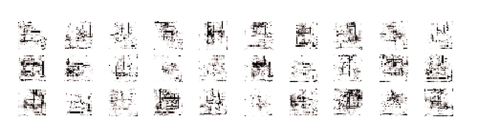

[[section|slide]]

Over the course of this workshop, participants train purpose-built image-based ML models to evaluate candidate design solutions based on a variety of tacit and heretofore un-encapsulatable design criteria, such as architectural style, spatial experience, or typological features. Participants then deploy these models to the cloud, and integrate them into functional generative design systems via API calls.

[[section|slide]]

## House GAN

Complex machinations and plays of power between two competing ML allows for the generation of credible house types through 2D representation of their geometry. Generative Adversarial Networks (GAN) work in tandem with one network forging its best impression of a credible image and the other vetoing it as obviously fake or credible. Through the countless iterations of this process, each network hones its generative and detection skills.

Using the house training set, we ran iterations of GAN to have the machine generate its own versions of what it thinks is a house. The houses might not be meaningful or occupiable in the eyes of a practical critic, but the machine generating its own versions of data is significant in the design process as it can open up hidden solutions that have not been unearthed in human exploration of solutions. 

[[section|slide]]

[[section|slide]]

# Insider View: A 3D visualization of what a critic sees - Gabriel Payant, Antoine Maes & Timothy Logan
<!-------------------- -------------------->

[[section]]
As architectural designers, many files we work with are representations of the design, not the design artifact itself. When exploring ML based image recognition, we are challenged with the conversion of 3D information (as architectural design happens most often in 3D) to 2D information (as computer vision ML works with 2D images). The 3D representation of the design form had been converted into a series of 2D images (sections, elevations, isovists, etc), which make up the dataset that are fed as examples into the ML model. We still craved to visualize the series of 2D images in 3D, especially when the GAN generated its own versions of what a design form would be. Here, we created tools to approximate and synthesize 3D forms from the series of 2D images typical in a training dataset.
[[section]]

### What the Critic Sees in 3D
Current ML technology relies heavily on cumulative advancements in image recognition. Therefore, training an ML model to act as an architectural critic involves shifting the digital 3D representation designers use to synthetic 2D image. Once the ML starts its process, the intelligible 3D model is not updated to show the transformation the architectural artifact is undergoing. We investigated the potential for reverse engineering the process that generates the 2D depth map in order to provide the designer with an “insider view” of what is going on under the hood, thus expanding the possible interactions between actor, critic and designer.

[[section|slide]]

#### VOXEL SPACE

[[section|slide]]

#### MAPPED POINTS

[[section|slide]]

We then used two different strategies to turn these points back into masses. The first involved doing a mesh relaxation based on a charge given to each point using the Cocoon plug-in.

Cocoon image here

The second strategy was to determine a linear boundary for each Z level associated with each vertical pixel of the ML elevation and then extrude them by a distance equal to height of the pixel is standing for.

gif of levels extruding to the right size

We then applied the different strategies to different models of our dataset, both generated by the ML and translated from preexisting 3D models to 2D image in order to have a intelligible 3D representation of the artifacts.

# Grove : James Forren
<!-------------------- -------------------->
[[section]]

Grove compares different ideas about trees and how a machine learning model can be used to mimic an idea of "forest."  This is intended to test the way a machine learning model can be used to train architectural proposals to match an idealized image or experience.  A set of ideal forest types, alder, elm, tall conifer - are used to train a forest critic.  The critic, in turn, discerns from a series of forest proposals from a generative actor to find the shape and pattern which best satisfies the criteria of elm, tall coniferous, etc.  The process uses an isovist critic and actor, evaluating the forests perspectivally. 

[[section|slide]]

[[section]]

This initial study was not successful in developing a working optimization model.  What was learned is the significance of the type and quality of data provided to the machine learning model.  In this case our hypothesis is that the isovist trainer needed more trees closer to its position, a deeper tonal range in the generated images, and greater variety in the idealised tree types.
 
[[section|slide]]

[[section|slide]]

# Artificial Generation of Floor Plans : Ben Coorey & Nonna Shabanova
<!-------------------- -------------------->
[[section|slide]]
Armed with a large dataset of consistent residential floor plans with a decent level of consistency, this team annotated the floor plans with features and trained an ML model to recognize various features on a residential floor plan, such as doors, windowns, etc).   

#### Detect Features

We trained a Convolutional Neural Network to detect the key elements of an apartment that provide the minimal information for the computer to describe the structure of an apartment. The trained model identifies windows and doors from images of floor plans, which are constructed into a network graph using parametric tools.

#### Represent Floor Plans as a Network Graph

 Each network graph (new representation of floor plans) was then classified by shape and style of windows / ventilation strategy such as Wrap Around, Corner, Complex, Single Aspect, Cross-Through. A ML model trained to classify these various types is well-suited to unearth hidden relationships between such patterns and the designed space.

#### Classify Floor Plans
Each floor plan was allocated into types which were then trained into a predictive AI model to implement a workflow that can detect features from an image of a floor plan, and then determine the type of floor plan automatically.

#### Generate New Floor Plans
Experimentation with Generative Adversarial Networks that are trained on a library of floor plans, which then allow the computer to generate populations of novel unique floor plans from scratch.

# Shaping Tall Buildings for Wind Effects : Samantha Walker & Marantha Dawkins
<!-------------------- -------------------->
[[section|slide]]

## Training the Critic

[[section]]

A building's shape is the most influential factor in mitigating wind effects. Using results from tests that were performed at SOM's wind tunnel in Chicago, the WT 260, an ML model is trained to assess the performance of tall buildings under wind loads based on building shape and orientation. Massing models at a 1:500 scale are positioned at the back of the wind tunnel on a load cell that measures different parameters such as frequency, displacement and forces. For the purposes of training the ML model, this data has been interpreted and organized into five different qualitative categories of wind performance: bad, fair, moderate, good and excellent. 

[[section|slide]]

[[section|slide]]

### Voxelized Actor

[[section]]

text

[[section|slide]]

[[section|slide]]

### Sectional Actor

[[section]]

text

[[section|slide]]

[[section|slide]]

### Figurative and Performative Optimization

[[section]]

text

[[section|slide]]

