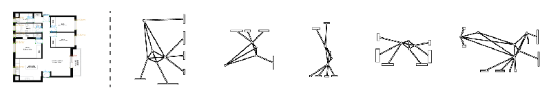

Over the course of this workshop, participants train purpose-built image-based ML models to evaluate candidate design solutions based on a variety of tacit and heretofore un-encapsulatable design criteria, such as architectural style, spatial experience, or typological features. Participants then deploy these models to the cloud, and integrate them into functional generative design systems via API calls.

[[section|slide]]

# Artificial Generation of Floor Plans
<!-------------------- -------------------->
## Ben Coorey & Nonna Shabanova

Armed with a large dataset of real-estate format residential floor plans with a decent level of consistency, this team annotated the floor plans with features and trained an ML model to recognize various features on a residential floor plan, such as doors, windowns, etc).   

[[section]]

#### 1. Detect Features

We trained a Convolutional Neural Network to detect the key elements of an apartment that provide the minimal information for the computer to describe the structure of an apartment. The trained model identifies windows and doors from images of floor plans, which are constructed into a network graph using parametric tools.

[[section]]

#### 2. Classify Floor Plans
Each floor plan was allocated into types which were then trained into a predictive AI model to implement a workflow that can detect features from an image of a floor plan, and then determine the type of floor plan automatically.

[[section]]

#### 3. Generate New Floor Plans
Experimentation with Generative Adversarial Networks that are trained on a library of floor plans, which then allow the computer to generate populations of novel unique floor plans from scratch.

[[section|slide]]

