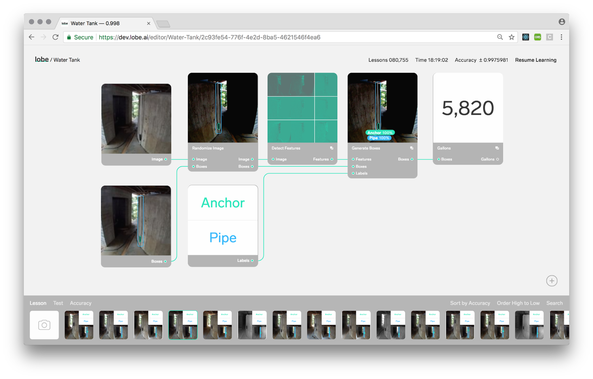

This workshop cluster, a part of the [2018 Smart Geometry Conference](https://www.smartgeometry.org/sg18/) hosted by the [University of Toronto](https://www.daniels.utoronto.ca/), brings recent developments in machine learning (ML) to bear on generative architectural design. To improve the utility of artificial intelligence as a creative partner for design, we have brought together experts from architectural design practice, ML engineering, and design methods research. 

[[section|slide]]
Here we report on the results of research conducted, and describe methods for the incorporation of user-generated image-based ML recognition models into the evaluation step of a traditional generative design workflow.

[[section|slide]]
This project uniquely links the familiar parametric environment of Grasshopper with cloud-hosted models trained using Lobe.ai: a user-friendly ML graphic programming environment that runs Tensorflow.

[[section]]
Over the course of this workshop, participants train purpose-built image-based ML models to evaluate candidate design solutions based on a variety of tacit and heretofore un-encapsulatable design criteria, such as architectural style, spatial experience, or typological features. Participants then deploy these models to the cloud, and integrate them into functional generative design systems via API calls.

[[section|slide]]
### Studies

The integration of an ML evaluation step into a generative design workflow opens up a range of possible design scenarios. As a proof of concept, just two design scenarios were explored during this abbreviated workshop, chosen both to illustrate the new opportunities brought about by ML, and to demonstrate the breadth of potential applications implied by our approach to the subject.

[[section|slide]]
#### 3d Spatial Composition from 2d Isovists

[[section]]

Seeking to validate and extend previous work[^Peng2017] in which local spatial compositions are captured and identified using machine learning, an ML model is trained to distinguish a given set of spatial configurations given an unrolled 2d image of a 3d isovist. This model is deployed in the service of tuning a parametric model to produce new and unexpected combinations of spatial experience.

[^Peng2017]: Peng, et al. 2017 Machines' Perception of Space: Employing 3D Isovist Methods and a Convolutional Neural Network in Architectural Space Classification

[[section|slide]]
#### Autoencoding the Single Family Home

[[section]]

Using a corpus of 3d models, an ML model is trained to distinguish between and classify architectural massings related to a single programmatic type: the detached North American single family home. To accomplish this, a method is developed to translate sliced CAD models into sets of related images able to be understood by ML processes. This model is deployed in the service of discovering potential new and compelling massings that hybridize known types.

# Methods
<!-------------------- -------------------->

To maintain focus on the evaluation of candidate designs using ML models, technologies necessary for a rudimentary generative design workflow have been prepared in advance of the workshop and are quickly introduced to participants.

[[section|slide]]

We understand the generative design workflow to consist of:

[[section|slide]]

A design schema capable of generating new design options based on a limited set of variables. 

We call the production of new designs ***the actor***.

[[section|slide]]

A means of discerning more desirable options from less desirable ones, and which may be employed to evaluate options produced the actor. 

We term this process ***the critic***.

[[section|slide]]

A means of creating variations, and of navigating the space of possible designs, as defined by the actor, in search of better performing solutions, as understood by the critic. 

This iterative process is ***an optimization***. 

[[section]]

## Technical Overview of the Basic Workflow

We establish a workflow that allows us to focus on the unique contribution of the cluster: the development of methods for the integration of ML evaluation routines into a parametric environment. To proceed as a generative design workflow, the three basic concerns outlined above must be addressed. As an overview of the software involved, these are addressed as such:

[[section|slide]]
***We define an "actor"*** as a parametric model in Grasshopper able to generate of candidate design solutions. 
[[section]]
This approach fits easily into the common skill-set of most digitally-motivated architects, and we expect workshop participants arrive with basic parametric modeling skills.

[[section|slide]]

***We train a "critic"*** as a machine learning model capable of appropriate architectural evaluation. 

[[section]]

Here is where much of the work of the cluster lies. Here we must establish training datasets via a variety of methods (some of which require scripting in Python), train image-based models using Tensorflow, host these models on cloud servers dedicated to this purpose, and establish structures to call upon them using an application program interface (API). In support of this workflow, we have partnered with Lobe.ai, a visual programming language for creating neural networks. Using the Grasshopper-like graphical programming environment provided by Lobe, workshop participants are able to design a model, use a pre-trained one, and receive predictions from the cloud.
I am another paragraph inserted without a line break.

[[section|slide]]

***We orchestrate an "optimization"***, using existing optimization plugins for Grasshopper.

[[section]]

By pitting actor against critic, using existing tools such as Galapagos, Opossum or similar, the space of possible designs (defined by the actor) is iteratively explored in order to identify the best performing solutions (in the eyes of the critic). To this end, a toolset has been established that supports the integration of a trained and hosted ML model into a general generative design workflow. A set of components in Grasshopper are provided that construct API calls to the hosted model, receive results, and processes this information into Grasshopper compatible data. 

# A New Leaf
<!-------------------- -------------------->

Here, we describe a rudimentary example that illustrates the basic workflow outlined above.

