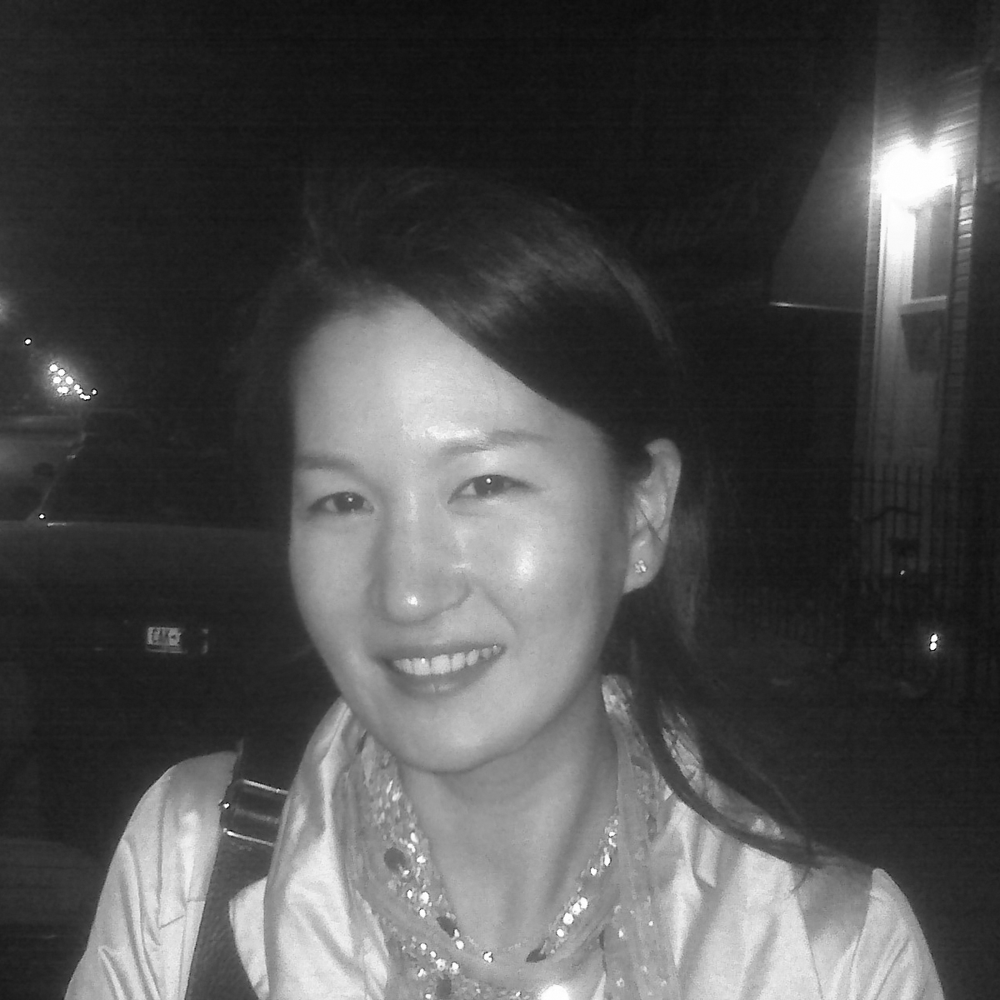

## Aims

This cluster brings recent developments in machine learning (ML) to bear on generative architectural design. To improve the utility of artificial intelligence as a creative partner for design, we have brought together experts from architectural design practice, ML engineering, and design methods research, and have developed methods for the incorporation of user-generated image-based ML recognition models into the evaluation step of a traditional generative design workflow. While existing research has integrated low-level ML operations into the parametric design environment with a level of success, this proposal uniquely links the familiar environment of Grasshopper with cloud-hosted models trained using the high-level and relatively user-friendly Tensorflow framework. 

((For a survey of existing ML-related plugins for Grasshopper, see the relevant Appendix below.))

Over the course of this workshop, participants will train purpose-built image-based models to evaluate candidate design solutions based on a variety of tacit and heretofore un-encapsulatable design criteria of their choosing, such as architectural style, spatial experience, or typological features. Participants will then deploy these models to the cloud, and integrate them into functional generative design systems via API calls.

[[section|slide]]
### Potential Studies

The integration of an ML evaluation step into a generative design workflow opens up a range of possible design scenarios. While **the definition of specific studies will be left to the discretion of workshop participants**, a number of potential studies are listed here. This abbreviated list was compiled both to illustrate the new opportunities brought about by ML, and to demonstrate the breadth of potential applications implied by our approach to the subject.

[[section|slide]]
#### Transferring Visual Style from Architectural Photography

[[section]]

Using tagged photographs of buildings from the Avery Library of architectural images provided by ArtStor, an ML model is produced that is capable of distinguishing photographs that adhere to desired architectural styles and/or the compositional style of particular architectural photographers. This model is deployed in the service of optimizing a design (as seen from a given point of view) to best match a desired style.

[[section|slide]]
#### Autoencoding Architectural Massing

[[section]]

Using a corpus of 3d models of tall buildings provided by SOM, an ML model is trained to distinguish between and classify architectural massings related to programmatic types. To accomplish this, a method is developed to translate sliced CAD models into sets of related images able to be understood by ML processes. This model is deployed in the service of discovering potential new and compelling massings that hybridize known types.

[[section|slide]]
#### 3d Spatial Composition from 2d Isovists

[[section]]

Seeking to validate and extend previous work[^Peng2017] in which local spatial compositions are captured and identified using machine learning, an ML model is trained to distinguish a given set of spatial configurations given an unrolled 2d image of a 3d isovist. This model is deployed in the service of tuning a parametric model to produce new and unexpected combinations of spatial experience.

[^Peng2017]: Peng, et al. 2017 [Machines' Perception of Space: Employing 3D Isovist Methods and a Convolutional Neural Network in Architectural Space Classification](http://papers.cumincad.org/cgi-bin/works/Show?acadia17_474 "Machines' Perception of Space: Employing 3D Isovist Methods and a Convolutional Neural Network in Architectural Space Classification") 

[[section|slide]]
#### Spatial Flow: Quantifying the Qualitative

[[section]]

Effectively quantifying tacit or intuitively-understood qualities of a design solution has long been an unmet aim. Addressing one such example, "spatial flow" (the ease by which one may circulate through a space), this study seeks to encapsulate this quality as the fitness criteria of an optimization. Given a candidate solution, a representation of circulation is derived using random walks of object-avoiding agents. An ML model is then trained to discern those schemes that encourage healthy flow from those that don't.

[[section|slide]]
#### Optimizing Architectural Visualizations for Social Media Exposure

[[section]]

Using metadata obtained from Facebook, Instagram,  Pinterest, or similar, an ML model is produced that is capable of predicting the popularity of an image on these social media platforms, parameterized for relevant data such as geolocation or demographics. This model is deployed in the service of optimizing architectural visualizations to best please particular crowds. 

# Methods
<!-------------------- -------------------->

To maintain focus on the evaluation of candidate designs using ML models, technologies necessary for a rudimentary generative design workflow - understood as outlined below - will be prepared in advance of the workshop and quickly introduced to participants.

1. Generate 
2. Evaluate  
3. Iterate 

The generation of candidate design solutions will be defined as a parametric model in Grasshopper. The iteration step - exploring the space of possible solutions to find best performing options - will be handled using existing plugins (such as Galapagos or similar). With these standard pieces in place, we may focus on the unique contribution of the cluster: developing methods for the integration of ML evaluation routines into a parametric environment. These methods must address two basic concerns: training appropriate ML models, and calling upon these models to evaluate candidate design solutions.

Regarding the first concern, we will assist participants to establish training datasets, train image-based models using Tensorflow and Lobe.ai, host these models on cloud servers dedicated to this purpose, and establish structures to call upon them using an application program interface (API). For this purpose, we have partnered with Lobe.ai, a visual programming language for creating neural networks. Using the Grasshopper-like graphical programming environment provided by Lobe, workshop participants will be able to design a model, use a pre-trained one, and receive predictions from the cloud. Regarding the second concern, a toolset will be established in advance of the workshop that supports the integration of a trained and hosted ML model into a general generative design workflow. A component in Grasshopper will be provided that constructs API calls to the hosted model, and then receives and processes the results. This process is further elaborated below.
The following lists describe the prerequisites for participation in the workshop, outline the resources and tools that will be provided to participants, and account for the methods that will be developed and tested over the course of the workshop. A clear workshop schedule may be found in Appendix A.

Participants in this workshop will be expected to arrive with:

* A basic competency in parametric modeling in Grasshopper and/or scripting in Python.
* Experience in generative design, preferably using Grasshopper for design generation and one of a number of optimization tools (Galapagos, Octopus, or similar) for iteration.

Prior to the start of the workshop, the cluster organizers will provide participants with:
* Grasshopper components for interacting via API calls with a cloud-hosted ML model. These components will take in image data, perform the API call to the model, receive a response, and translate results into GH data.
* A suite of tools written in Python to assist students in establishing training sets of tagged images. This may include web scraping tools for exploring online datasets such as Instagram or Pinterest, as well as automated image processing tools for preparing large collections of images for training.

Over the course of the workshop, we will introduce methods for and competencies in:
* Establishing training sets for ML models, including collecting datasets via web scraping
* Training and testing ML models in Tensorflow
* Hosting trained models and establishing API protocols

# Sponsorship, Support, and Expected Costs
<!-------------------- -------------------->

# Outcomes
<!-------------------- -------------------->

# Workshop Schedule and Requirements
<!-------------------- -------------------->

# Biographies of Cluster Organizers
<!-------------------- -------------------->

[[section|slide]]
## Adam Menges, Lobe

[[section]]

As CEO of Lobe, a visual programming environment for creating neural networks, Adam currently spends the majority of his time working on technologies and tools to make machine learning easier for the masses. Previously, he worked as an engineer and contributed to the success of world class companies, such as Apple and SendGrid.

[[section|slide]]
## Kat Park, SOM

[[section]]

As Firmwide Emerging Technology Leader, Kat Park directs design technology strategy at SOM. A computer scientist and architect specializing in computation design, Kat Park spearheads research initiatives to understand the role of data in performance based design, as well as explore the design and implementation of sensor systems that inform occupants' environment. As a senior designer at SOM NY, she has led the design, data management and implementation of complex geometrical systems for skyscrapers around the world. Her work at SOM NY includes World Trade Center Tower 1, Lotte Super Tower, Busan Lotte Tower, Yongsan Tower, and Digital Media City Landmark Tower in Korea, as well as research efforts that inform design processes. Kat Park has lectured and taught parametric and generative design strategies at various institutions; presented and published in ACADIA, International Journal of Architectural Computing (IJAC), International Conference on Environmental Systems (ICES), Special Interest Group in Computer Human Interaction (SIGCHI), SmartGeometry, BIM Forum and Architecture and Urbanism (A+U). Prior to SOM and architecture, she was an interdisciplinary software developer and interaction designer at Art Technology Group and MIT Media Lab. Kat Park holds a BS in Computer Science & Engineering and a Master of Architecture degree, both from MIT.

[[section|slide]]

## Kyle Steinfeld, UC Berkeley

[[section]]

Through his research and creative work, Kyle Steinfeld, an Assistant Professor of Architecture at the University of California, Berkeley, seeks to illuminate the dynamic relationship between the creative practice of design and computational design methods, thereby enabling a more inventive, informed, responsive, and responsible practice of architecture. He is the author of Geometric Computation: Foundations for Design and has published widely on the subject of design and computation. His recent work has specifically focused on the newly emerging topic of machine learning in design. 

In 2016, Professor Steinfeld organized and moderated a session titled Procedural Design: Machine Learning and Evaluation at the 2016 ACADIA conference in Ann Arbor. Building on the conversation that unfolded there, while speaking at the invitation of the Kuwait University College of Architecture, he offered a talk titled Fresh Eyes that drew out a number of parallels between machine learning, visual thinking, and the nature of design activity. Further developing and refining these ideas, he authored a paper for the 2017 ACADIA conference titled Dreams May Come. Here, he set out a concise theory of machine learning as it applies to creative architectural design, and offered a guide to future research at the intersection of ML and design tools. Most recently, Kyle sought to put these ideas into practice with a series of online experiments, titled Drawing with Bots, that explore a variety of potential forms and formats for the relationship between a human designer and an artificial design partner.

[[section|slide]]
## Samantha Walker, SOM

[[section]]

Samantha Walker is a Senior Structural Engineering Professional at SOM. With a background in architecture and over ten years of experience in structural engineering, she promotes a collaborative, integrated approach to design. Through SOM, Samantha has acted as an advisor and reviewer for several architectural tall building studios at both the college and university levels. She sits on the board of advisors for New Story, a non-profit startup in the Bay Area that builds sustainable homes and communities in developing countries. Samantha also specializes in the design of high performance seismic protection systems, such as base isolation and dampers, and has designed structures in regions with high seismicity, including Haiti and California. She recently traveled to Mexico City with a team of colleagues in the aftermath of the September 19, 2017 earthquake to contribute to post-earthquake building reconnaissance efforts. Shortly afterwards, Samantha presented the team's findings at the EDIFICA 2017 Congress held at the Monterrey Institute of Technology and Higher Education. To enhance reconnaissance efforts, Samantha spearheaded the development of a photo recognition tool that utilizes machine learning to identify and classify damage from photographs of damaged buildings. She has a strong interest in further exploring how machine learning can influence and enhance different aspects of building design, construction and assessment. Samantha holds professional engineering licenses in both Canada and the United States and a Master of Engineering degree from McGill University.

[[section|slide]]
## What is Lobe.ai?
<!-------------------- -------------------->

[Lobe](Lobe.ai "Lobe") is a browser-based graphical programming environment for creating neural nets. 

